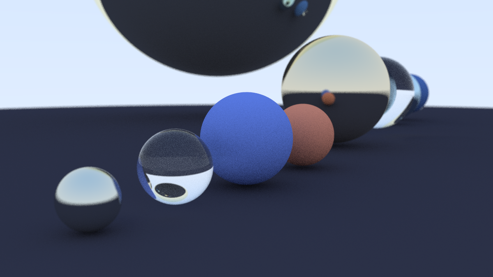

# Forked from Raytracing in One Weekend

A improvised solar system based on balls with differents materials provided before. Our goal is using at least one ball per material, in other words, at least three balls.


---------------------
How can you build?
First, on terminal:
  - cmake -B build
  - cmake --build build
    
To generate the image:
  - build\Debug\inOneWeekend.exe > image.ppm

Now, your image is ready to be viewed. It's called ```image.ppm```.
You can view it on your computer if it supports or use a online ppm viewer.

## Our team
*   [André Esteves](https://github.com/andretva777)
*   [Eric Lopes](https://github.com/Erictf32)
*   [Guilherme Braga](https://github.com/gbraga29)
*   [Gustavo Bianchini](https://github.com/gustavo-bm)
